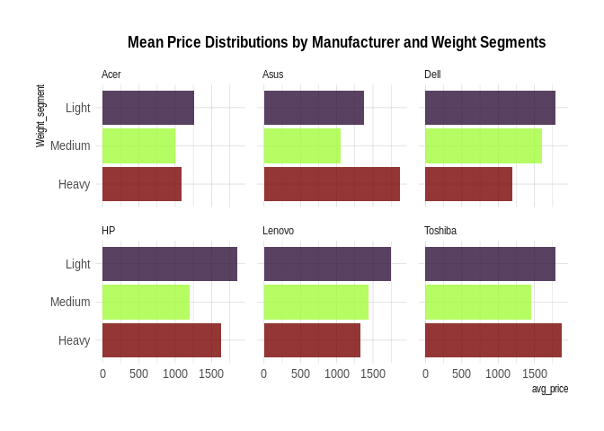

Manufacturer and Device Weight Effects on Market Price
================
Christine Gonzalez
2026-05-22

#### ANOVA TWO FACTOR WITH REPLICATION

This ANOVA two-factor model was developed to compare effects from a
laptop dataset in R against the same model developed with Excel’s Data
Analysis Toolpak. The two factors, laptop manufacturer and device
weight, were observed for effects on market price. Device weights were
categorically segmented into light, medium, and heavy distributions.
Since I was working with an unbalanced design, a smaller sample of the
original dataset was used in the Excel model to help reduce misleading
or biased results. The final design consists of three replicas for a
total of nine combinations across two factors.

Key Findings from Excel Model: Manufacturer alone had no effect on
market prices of laptops. While weight segments and interaction between
manufacturer and weight segments had a significant effect on market
price, explaining ~50% observed variance -- or ~28% and ~22% respectively.

The same model in R, using Type III ANOVA, yielded slightly similar
results with some differences among factors after utilizing the larger
dataset. Key Findings: Weight alone explained minimal additional
variance after accounting for interaction effects. While manufacturer
and interaction between Manufacturer and weight segments had significant
effects on market price, explaining ~16-17% observed variance.

Key Takeaway: Even with the reduced data, the interesting thing about
the Excel model is that it’s actually plausible in today’s economy given
the increasing demand for heavy gaming laptops with more processing
power and ultralight laptops for easy portability. Both device weights
are generally more expensive and consumers sometimes overlook
manufacturer if the device meets the right specifications and components
for their needs.

    ## Anova Table (Type III tests)
    ## 
    ## Response: Price
    ##                                                 Sum Sq  Df F value    Pr(>F)
    ## (Intercept)                                   14109345   1 51.8265 1.086e-11
    ## lap_data$Manufacturer                          4441982   5  3.2633  0.007377
    ## lap_data$Weight_segment                          65199   2  0.1197  0.887209
    ## lap_data$Manufacturer:lap_data$Weight_segment  6822374  10  2.5060  0.007313
    ## Residuals                                     56626353 208                  
    ##                                                  
    ## (Intercept)                                   ***
    ## lap_data$Manufacturer                         ** 
    ## lap_data$Weight_segment                          
    ## lap_data$Manufacturer:lap_data$Weight_segment ** 
    ## Residuals                                        
    ## ---
    ## Signif. codes:  0 '***' 0.001 '**' 0.01 '*' 0.05 '.' 0.1 ' ' 1

<!-- -->
